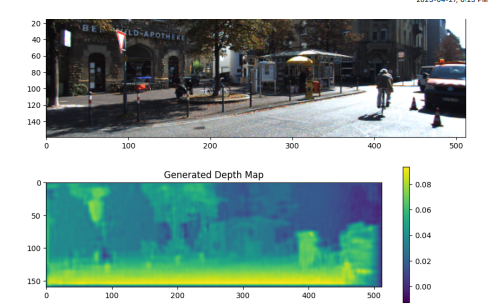
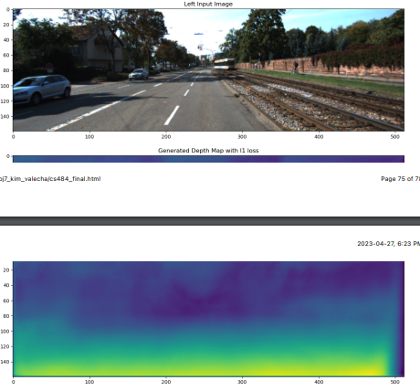

## Monocular Depth Estimation

By: Vaibhav Valecha (vvalecha@uwaterloo.ca) and Huck Kim (h363kim@uwaterloo.ca)

## Monocular Depth Estimation

## Abstract
The problem we will be trying to solve is monocular depth estimation. Determining depth
is a task that humans perform easily through stereo vision, which involves capturing two
images using each eye and determining the offset of the two images to calculate depth.
Of course this is done subconsciously.
Similarly when working with computers, when we have 2 stereo images we have
techniques to get an estimated depth map (such as the algorithms implemented in A4).
To date there are several techniques that allow us to determine depth maps, including
depth from focus, vanishing point detection, and others. For example, when looking at a
picture of a road, the road appears wider near the camera but converges to a single
point in the horizon. This allows us to infer that the part of the road converging to the
vanishing point is further away than the part where the road appears wider.

## Report structure

The code portion of our notebook is organized into various sections:
1. Data retrieval- obtain and load the KITTI dataset into sanity_dataloader ,
train_dataloader , and test_dataloader and apply various image
transformation ie, saturation, brightness, resize and cropping
2. Neural Network Architecture- Develop the core components for the neural network,
it's loss functions, and the bilinear sampler.
3. Training Model- train various models on different loss functions and the different
datasets.
4. Results- display plots on the various models

## Results
Note image 1 used overfit model whereas image2 was trained on various images

## Extension

read cs484_final.pdf for more details and full report
